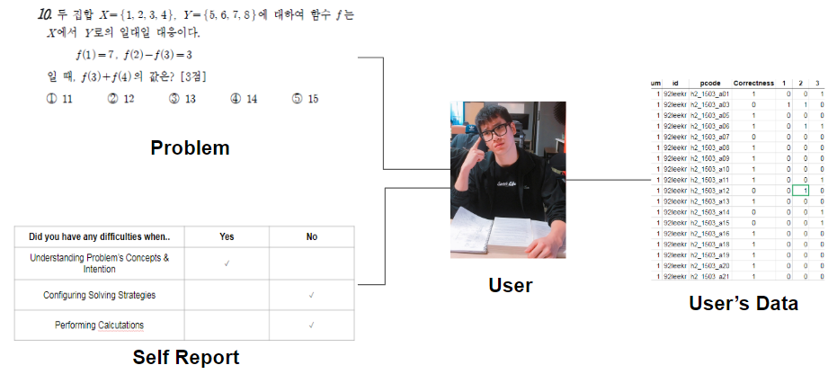

# ThinkBig : Analyze math problem solving ability of a student & problem recommendation service

##### WEB: https://thinkbig.herokuapp.com

## Introduction
A service providing vulnerable user-type math problems to users through personalized self-report
- Motivation : Cost too much time and effort to study
- Goal : Analyze performance & Recommend math problems
- Tech
	- User Interface: Web by Ruby on Rails (https://github.com/thinkbigsv/EduWeb)
	- Data Visualization : d3-js, Python(matplotlib, seaborn, plotly)

## Generation of Data

The data are based on the first grade math curriculum of Korean high school students.
- problemset.csv
	- pcode: problem code
		- e.g. h2_1503_a01 == 고등학교 2학년, 15년 3월 전국학력평가 수학 [가]형 1번 문제
	- domain1 : 대단원
	- domain2 : 중단원
	- domain3 : 소단원
	- complexity : the number of domains in a problem
	- difficulty : it will be replaced by 'error'
	- error : students' error rate of a problem
	- answer : correct answer (in multiple choice question)

After the user solve the problem, the user check the **self-report** as below.

| Did you have any difficulties when...   |  Yes  |  No   |
| --------------------------------------- |:-----:|:-----:|
| Understanding Problem’s Concepts        |       |   ✓   |
| Configuring Solving Strategies          |   ✓   |       |
| Performing Calculations                 |       |   ✓   |

Currently, user data are generated by program (pre-set agent)
- userdata.csv
	- pcode
	- correct: 0 or 1
	- report1: 0 or 1
	- report2: 0 or 1
	- report3: 0 or 1

## Data Analysis
**method 1.**

- Each node is a one math problem
- Based on Self reporting data and whether user solve a problem correctly.

**method 2.**
- P = Incorrect ratio for each domain * Student’s correct ratio
Higher P value, Better student’s performance in the domain
- Q = Average of P values for problems with multiple domains
- P-Q = Measurement for a difficulty to solve problems with  several domains 

## Members
Kyeorye Lee

Suyeon Lee

seon Sim

Gyusu Han

Kanghyeon Seo

Chaejung Maeng
